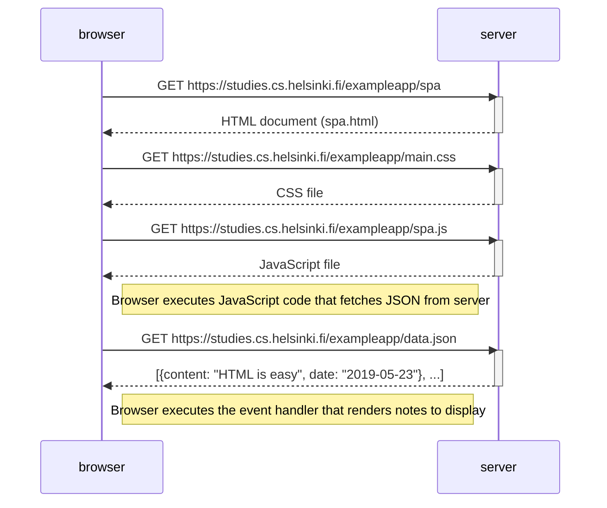
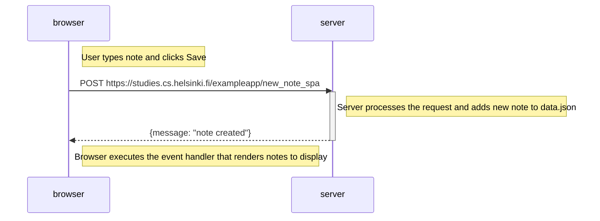

# Part 0 - Exercise Diagrams

## 0.5: Single Page App Diagram

```mermaid
sequenceDiagram
    participant browser
    participant server
    browser->>server: GET https://studies.cs.helsinki.fi/exampleapp/spa
    activate server
    server-->>browser: HTML document (spa.html)
    deactivate server
    browser->>server: GET https://studies.cs.helsinki.fi/exampleapp/main.css
    activate server
    server-->>browser: CSS file
    deactivate server
    browser->>server: GET https://studies.cs.helsinki.fi/exampleapp/spa.js
    activate server
    server-->>browser: JavaScript file
    deactivate server
    Note right of browser: Browser executes JavaScript code that fetches JSON from server
    browser->>server: GET https://studies.cs.helsinki.fi/exampleapp/data.json
    activate server
    server-->>browser: [{content: "HTML is easy", date: "2019-05-23"}, ...]
    deactivate server
    Note right of browser: Browser executes the event handler that renders notes to display
```

## 0.6: New Note in SPA

```mermaid
sequenceDiagram
    participant browser
    participant server
    Note right of browser: User types note and clicks Save
    browser->>server: POST https://studies.cs.helsinki.fi/exampleapp/new_note_spa
    activate server
    Note right of server: Server processes the request and adds new note to data.json
    server-->>browser: {message: "note created"}
    deactivate server
    Note right of browser: Browser executes the event handler that renders notes to display
```